# [Java-NIO](http://www.imooc.com/learn/1118)

## 1. 课程介绍

- Java 基础知识
- BIO 网络编程知识
- 多线程编程知识

## 2. NIO 网络编程模型

### 2.1. BIO 网络模型

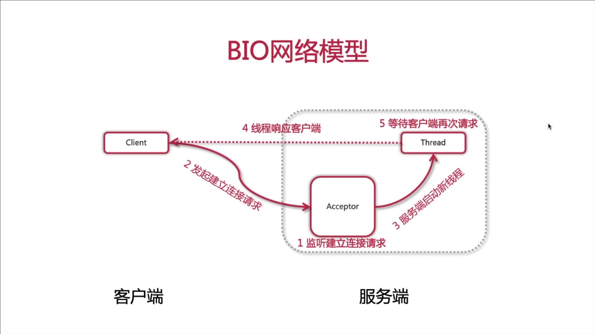

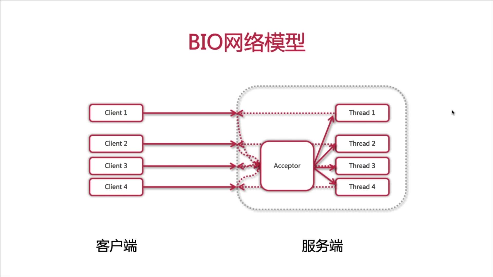

- **阻塞式 I/O 模型**： 如果客户端没有发起请求，服务的会一直存在并等待连接；
- **弹性伸缩能力差**：每一个对服务端的连接就需要开启一个线程，连接数很可能超过服务器所能负载的最大线程数；
- **多线程耗资源**：创建，销毁，维护大量线程以及线程切换都非常消耗系统资源。

### 2.2. NIO 网络模型

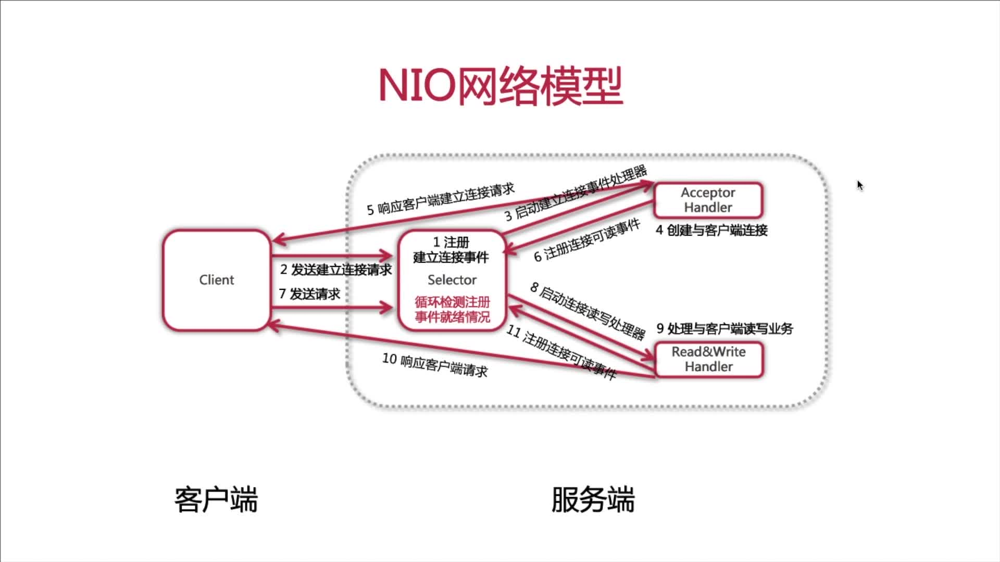

- **非阻塞 IO 模型**：服务器端提供一个单线程的 selector 来统一管理所有客户端接入的连接，并负责监听每个连接所关心的事件；
- **弹性伸缩能力加强**：服务器端一个线程处理所有客户端的连接请求，客户端的个数与服务器端的线程数呈 M 比 1 的关系；
- **单线程节省资源**：避免了线程的频繁创建和销毁，同时也避免了多个线程之间上下文的切换，提高了执行效率。

## 3. NIO 网络编程详解

NIO 核心

- `Channel`：通道
- `Buffer`：缓冲区
- `Selector`：选择器或多路复用器

### 3.1. Channel

特点：

- 双向性
- 非阻塞性
- 操作唯一性

实现：

- 文件类：`FileChannel`
- UDP 类：`DatagramChannel`
- TCP 类：`ServerSocketChannel` / `SocketChannel`

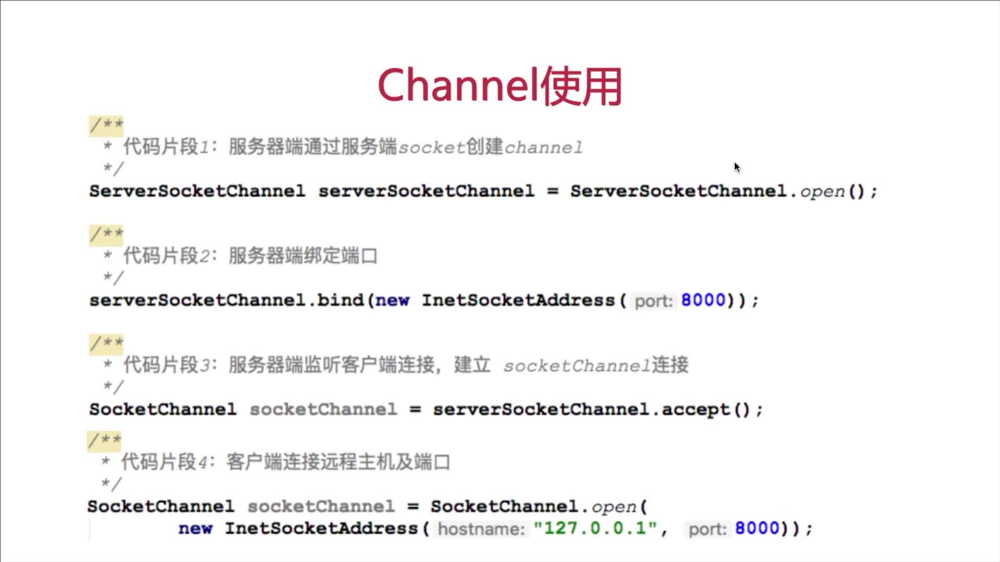

### 3.2. Buffer

作用：读写 Channel 中数据

本质：一块内存区域

属性：

- `Capacity`：容量
- `Position`：位置
- `Limit`：上限
- `Mark`：标记

用法：

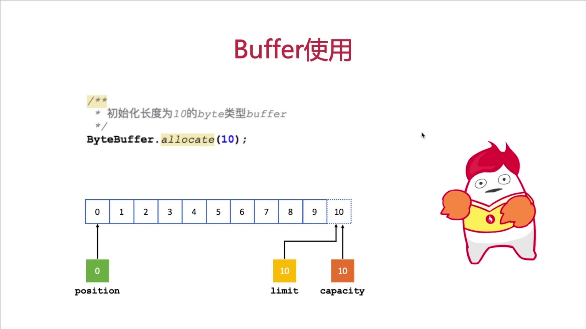

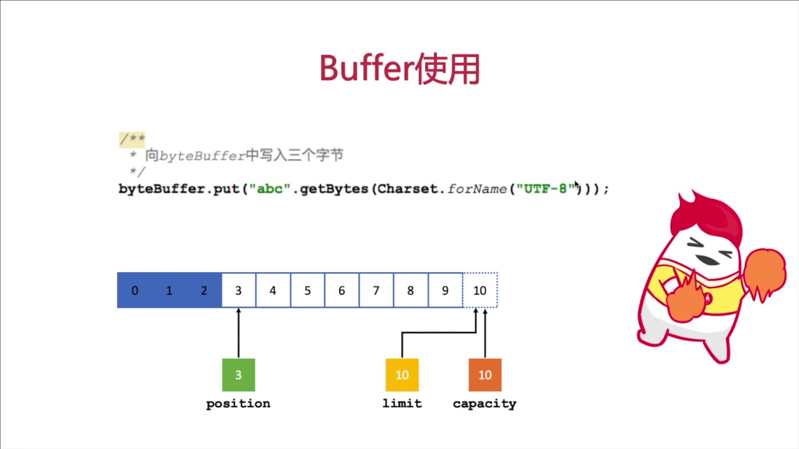

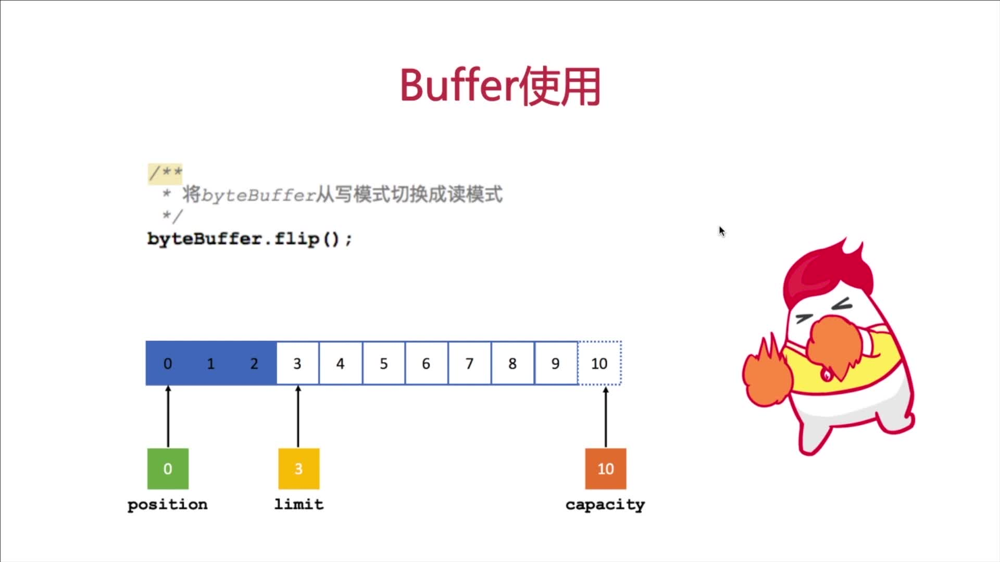

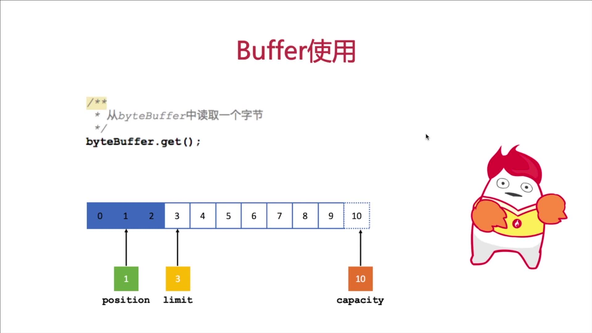

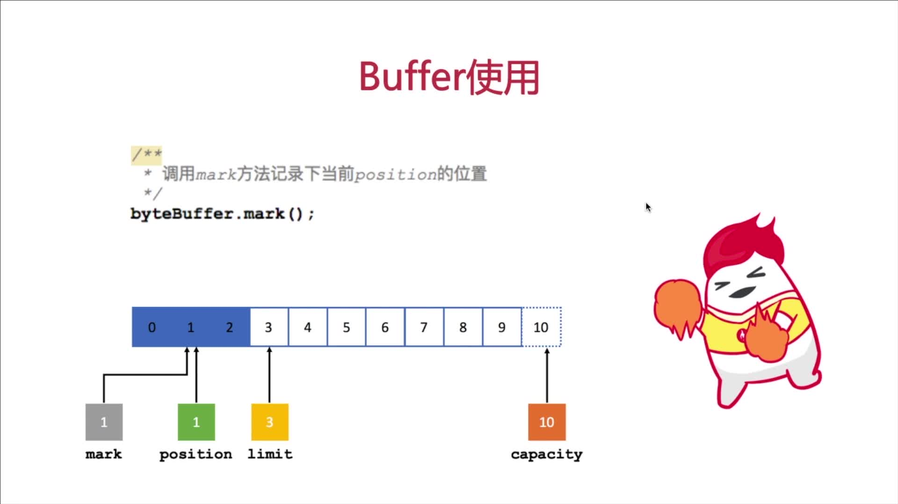


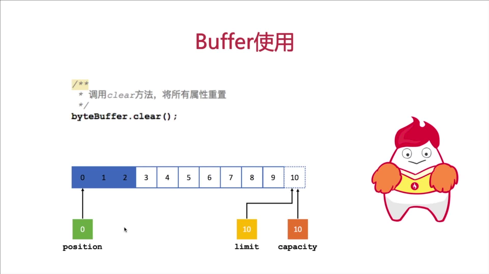

### 3.3. Selector

作用：I/O 事件就绪选择

地位：NIO 网络编程的基础之一

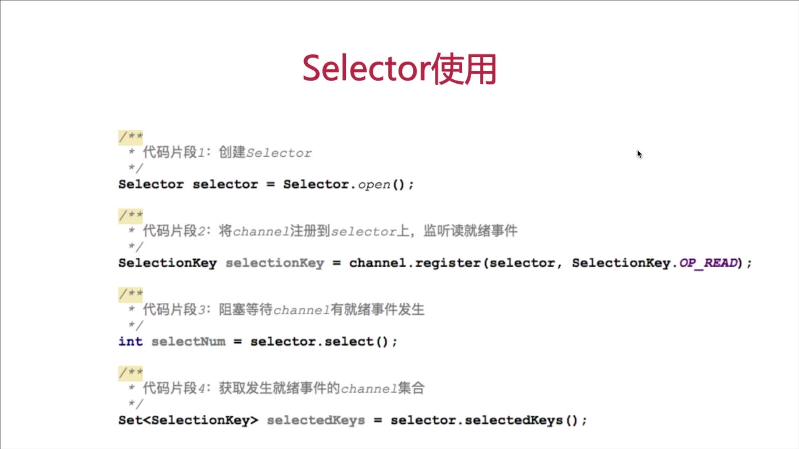

`SelectionKey` 提供四种就绪状态常量：

- 连接就绪：`connect`
- 接受就绪：`accept`
- 读就绪：`read`
- 写就绪：`write`

### 3.4. NIO 编程实现步骤

- 第一步：创建 `Selector`
- 第二步：创建 `ServerSocketChannel`，并绑定监听端口
- 第三步：将 `Channel` 设置为非阻塞模式
- 第四步：将 `Channel` 注册到 `Selector` 上，监听连接事件
- 第五步：循环调用 `Selector` 的 `select` 方法，检测就绪情况
- 第六步：调用 `selectedKeys` 方法获取就绪 `channel` 集合
- 第七步：判断就绪事件种类，调用业务处理方法
- 第八步：根据业务需要决定是否再次注册监听事件，重复执行第三步操作

## 4. NIO 网络编程实战

### 4.1. 服务器端

```java
/*
  1. 创建Selector
 */
Selector selector = Selector.open();
/*
  2. 通过ServerSocketChannel查u你更加爱你channel
 */
ServerSocketChannel serverSocketChannel = ServerSocketChannel.open();
/*
  3. 为channel绑定监听端口
 */
serverSocketChannel.bind(new InetSocketAddress(8000));
/*
  4. 设置Channel为非阻塞模式
 */
serverSocketChannel.configureBlocking(false);
/*
  5. 将Channel注册到Selector上，监听连接事件
 */
serverSocketChannel.register(selector, SelectionKey.OP_ACCEPT);
System.out.println("服务器端启动成功！");
```

```java
/*
  6. 循环等待新接入的连接
 */
for (; ; ) {
    /*
      获取可用channel数量
     */
    int readChannels = selector.select();
    if (readChannels == 0) {
        continue;
    }
    /*
      获取可用channel地集合
     */
    Set<SelectionKey> selectionKeySet = selector.selectedKeys();
    Iterator iterator = selectionKeySet.iterator();
    while (iterator.hasNext()) {
        /*
          selectionKey实例
         */
        SelectionKey selectionKey = (SelectionKey) iterator.next();
        /*
          移除Set中当前selectionKey实例
         */
        iterator.remove();
        /*
          7. 根据对应状态，调用对应方法处理业务逻辑
         */
        if (selectionKey.isAcceptable()) {
            /*
              如果是接入事件
             */
            acceptHandler(serverSocketChannel, selector);
        }
        if (selectionKey.isReadable()) {
            /*
              如果是可读事件
             */
            readHandler(selectionKey, selector);
        }
    }
}
```

```java
private void acceptHandler(ServerSocketChannel serverSocketChannel,
                           Selector selector)
        throws IOException {
    /*
      如果要是接入事件，创建socketChannel
     */
    SocketChannel socketChannel = serverSocketChannel.accept();
    /*
      将socketChannel设置为非阻塞工作模式
     */
    socketChannel.configureBlocking(false);
    /*
      将channel注册到selector上，监听可读事件
     */
    socketChannel.register(selector, SelectionKey.OP_READ);
    /*
      回复客户端提示信息
     */
    socketChannel.write(StandardCharsets.UTF_8
            .encode("你与聊天室里其他人都不是朋友关系，请注意隐私安全"));
}
```

```java
private void readHandler(SelectionKey selectionKey, Selector selector)
        throws IOException {
    /*
      要从SelectionKey中获取到已经就绪的channel
     */
    SocketChannel socketChannel = (SocketChannel) selectionKey.channel();
    /*
      创建buffer
     */
    ByteBuffer byteBuffer = ByteBuffer.allocate(1024);
    /*
      循环读取客户端请求信息
     */
    StringBuilder request = new StringBuilder();
    while (socketChannel.read(byteBuffer) > 0) {
        /*
          切换buffer为读模式
         */
        byteBuffer.flip();
        /*
          读取buffer中的内容
         */
        request.append(StandardCharsets.UTF_8.decode(byteBuffer));
    }
    /*
      将channel再次注册到selector上，监听他的可读事件
     */
    socketChannel.register(selector, SelectionKey.OP_READ);
    /*
      将客户端发送的请求信息，广播给其他客户端
     */
    if (request.length() > 0) {
        boardCast(selector, socketChannel, request.toString());
    }
}
```

```java
private void boardCast(Selector selector, SocketChannel sourceChannel,
                       String request) {
    /*
      获取到所有已接入的客户端channel
     */
    Set<SelectionKey> selectionKeySet = selector.keys();
    /*
      循环向所有channel广播信息
     */
    selectionKeySet.forEach(selectionKey -> {
        Channel targetChannel = selectionKey.channel();
        /*
          剔除发消息的客户端
         */
        if (targetChannel instanceof SocketChannel && targetChannel != sourceChannel) {
            try {
                /*
                  将消息发送到targetChannel客户端
                 */
                ((SocketChannel) targetChannel).write(StandardCharsets.UTF_8.encode(request));
            } catch (IOException e) {
                e.printStackTrace();
            }
        }
    });
}
```

### 4.2. 客户端

```java
/*
  连接服务器端
 */
SocketChannel socketChannel = SocketChannel.open(
        new InetSocketAddress("127.0.0.1", 8000));
System.out.println("客户端启动成功！");
/*
  接收服务器端响应
  新开线程，专门负责来接收服务器端的响应数据
  selector socketChannel 注册
 */
Selector selector = Selector.open();
socketChannel.configureBlocking(false);
socketChannel.register(selector, SelectionKey.OP_READ);
new Thread(new NioClientHandler(selector)).start();
/*
  向服务器端发送数据
 */
Scanner scanner = new Scanner(System.in);
while (scanner.hasNextLine()) {
    String request = scanner.nextLine();
    if (request != null && request.length() > 0) {
        socketChannel.write(StandardCharsets.UTF_8.encode(nickname + " : " + request));
    }
}
```

```java
for (; ; ) {
    int readChannels = selector.select();
    if (readChannels == 0) {
        continue;
    }
    Set<SelectionKey> selectionKeySet = selector.selectedKeys();
    Iterator iterator = selectionKeySet.iterator();
    while (iterator.hasNext()) {
        SelectionKey selectionKey = (SelectionKey) iterator.next();
        iterator.remove();
        if (selectionKey.isReadable()) {
            readHandler(selectionKey, selector);
        }
    }
}
```

```java
private void readHandler(SelectionKey selectionKey, Selector selector)
        throws IOException {
    SocketChannel socketChannel = (SocketChannel) selectionKey.channel();
    ByteBuffer byteBuffer = ByteBuffer.allocate(1024);
    StringBuilder response = new StringBuilder();
    while (socketChannel.read(byteBuffer) > 0) {
        byteBuffer.flip();
        response.append(StandardCharsets.UTF_8.decode(byteBuffer));
    }
    socketChannel.register(selector, SelectionKey.OP_READ);
    if (response.length() > 0) {
        System.out.println(response);
    }
}
```

## 5. NIO 网络编程缺陷

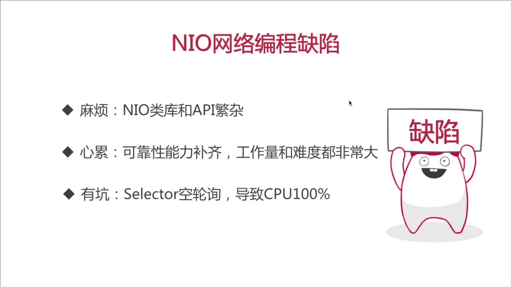
